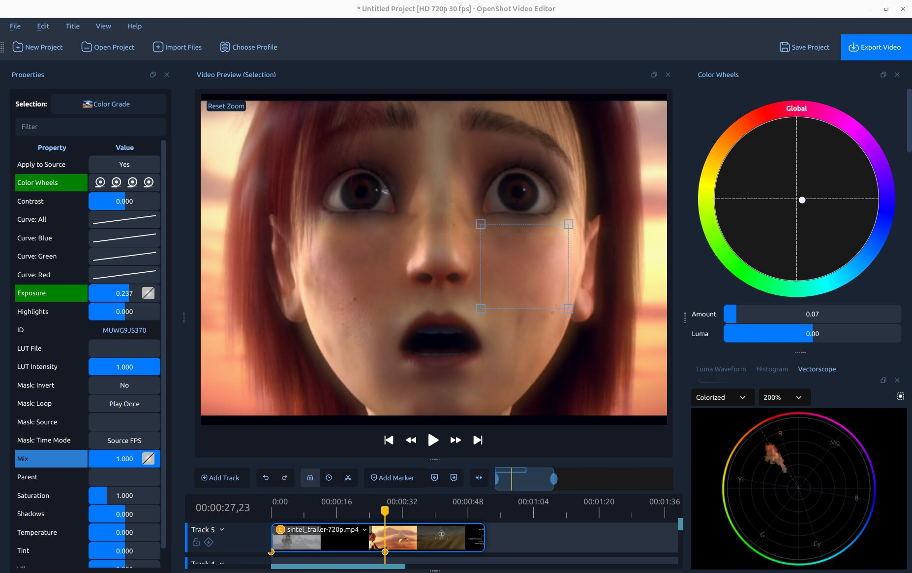
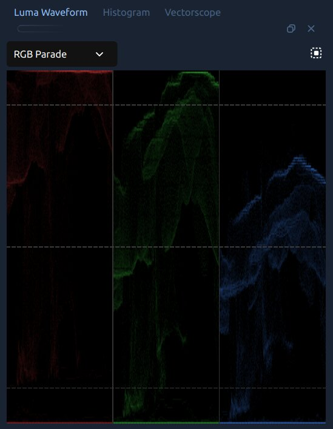
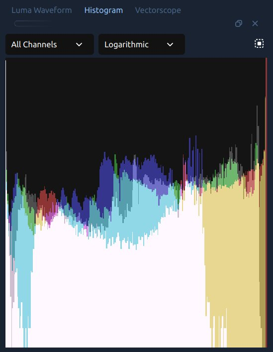
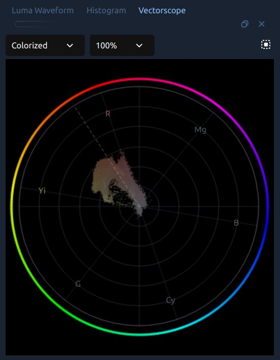
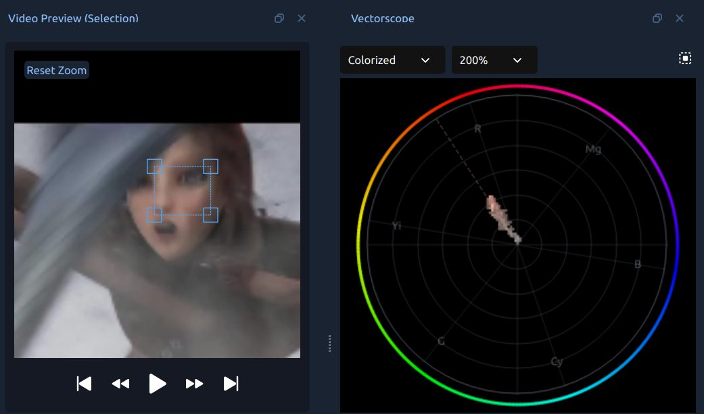
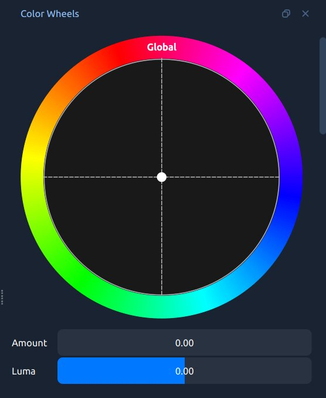
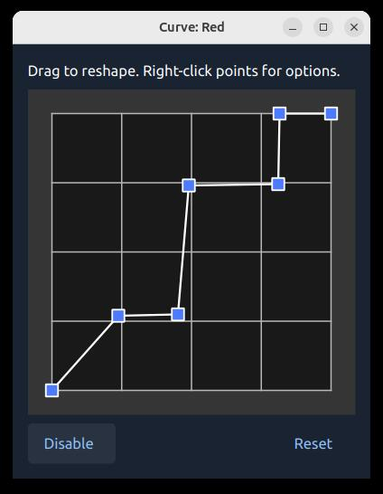

.. Copyright (c) 2008-2026 OpenShot Studios, LLC
 (http://www.openshotstudios.com). This file is part of
 OpenShot Video Editor (http://www.openshot.org), an open-source project
 dedicated to delivering high quality video editing and animation solutions
 to the world.

.. OpenShot Video Editor is free software: you can redistribute it and/or modify
 it under the terms of the GNU General Public License as published by
 the Free Software Foundation, either version 3 of the License, or
 (at your option) any later version.

.. OpenShot Video Editor is distributed in the hope that it will be useful,
 but WITHOUT ANY WARRANTY; without even the implied warranty of
 MERCHANTABILITY or FITNESS FOR A PARTICULAR PURPOSE.  See the
 GNU General Public License for more details.

.. You should have received a copy of the GNU General Public License
 along with OpenShot Library.  If not, see <http://www.gnu.org/licenses/>.

.. _color_ref:

Color
=====

Have you ever noticed that thriller films look gritty and desaturated while romantic comedies feel
vibrant and warm? That is not an accident — it is deliberate **color work**. Color is one of the most
powerful storytelling tools in video, and OpenShot gives you professional-grade tools to use it, whether
you are fixing a problem shot or building a cinematic look from scratch.

*The OpenShot Color View: video preview in the center, Color Wheels dock on the right, and video scopes
(Luma Waveform and Histogram) below.*

.. seealso::

   :ref:`effects_color_grade` in :doc:`effects` — full property reference and keyframe details for the
   Color Grade effect.

.. _color_basics_ref:

Understanding Color
-------------------

Every pixel in a digital video frame is made of three numbers: **Red**, **Green**, and **Blue** (each
0–255). White is all three at maximum; black is all three at zero; gray is any equal mix. Combining
primaries creates secondary colors (Red + Green = Yellow, Red + Blue = Magenta, Green + Blue = Cyan).

Four properties you will adjust constantly:

- **Exposure** — overall brightness. Overexposed footage has many pixels near 255 (blown-out
  highlights); underexposed footage is crushed near 0.
- **Contrast** — the spread between brightest and darkest. High contrast is dramatic; low contrast
  looks flat or milky.
- **Saturation** — how vivid the colors are. Zero saturation = grayscale. Cameras often record
  slightly less saturation than reality to give editors more room.
- **Hue** — the actual color (red, yellow, green, blue…). Shifting hue rotates all colors around
  the color wheel and is mostly used for creative stylistic effects.

Video Scopes — What They Are and Why They Matter
^^^^^^^^^^^^^^^^^^^^^^^^^^^^^^^^^^^^^^^^^^^^^^^^^

Your monitor is not a reliable measuring tool — room lighting, screen brightness, and uncalibrated
displays all affect what you see. **Video scopes** display the actual pixel values in your image as
precise graphs. They never lie, even if your monitor does.

OpenShot includes three scopes, all accessible from :guilabel:`View → Scopes` or opened automatically
by the clip menu options described in :ref:`getting_started_ref`:

- **Luma Waveform** — shows brightness across the frame, column by column. Instantly reveals
  overexposure, underexposure, and contrast problems. See :ref:`luma_waveform_ref`.
- **Histogram** — shows how many pixels exist at each brightness level. Great for exposure and
  channel balance at a glance. See :ref:`histogram_ref`.
- **Vectorscope** — a circular chroma plot showing the hue and saturation of every pixel. Ideal for
  checking color casts, overall saturation, and — with its built-in skin tone line — evaluating faces.
  See :ref:`vectorscope_ref`.

Every scope also has a **Region** button in its toolbar. Click it and drag a box over any part of
the video preview to restrict scope analysis to just that region — useful for isolating a face, sky,
or any specific area of the frame.

Color Correction — Fixing What Is Wrong
^^^^^^^^^^^^^^^^^^^^^^^^^^^^^^^^^^^^^^^^

**Color correction** is the process of fixing technical problems in footage so it looks the way
reality appeared: wrong white balance, bad exposure, flat contrast, unwanted color casts. The goal
is a clean, neutral image that looks natural and holds up on any screen. See :ref:`color_correction_ref`.

Color Grading — Building a Look
^^^^^^^^^^^^^^^^^^^^^^^^^^^^^^^^

**Color grading** is the creative step: using the same tools to give corrected footage a deliberate
visual mood or style. A warm golden nostalgia, a cold clinical thriller, a cinematic teal-and-orange
— grading is where footage goes from "looks right" to "looks intentional." See :ref:`color_grading_ref`.

.. _getting_started_ref:

Getting Started
---------------

OpenShot offers several ways to open its color tools, depending on what you need:

**Right-click a clip → Look → Adjust Colors**
   The quickest all-in-one setup. OpenShot adds the :guilabel:`Color Grade` effect to the clip,
   selects it, opens the :guilabel:`Properties` panel, and shows the :guilabel:`Color Wheels` dock
   and all three video scopes — ready to grade immediately.

**Right-click a clip → Look → Color → [preset]** *(Auto Contrast, Lift Shadows, Warm Up, Boost Color…)*
   Adds the Color Grade effect with a useful preset already applied. The Color Wheels and scopes
   are not opened automatically — open them any time from :guilabel:`View → Scopes`.

**Right-click a clip → Look → Analyze Colors**
   Opens all three scopes (Luma Waveform, Histogram, and Vectorscope, tabbed together on the right)
   without adding any Color Grade effect. Use this to evaluate footage before deciding whether it
   needs grading, or simply to monitor levels during playback.

**View → Color View** *(optional immersive mode)*
   Switches the entire interface into a dedicated color grading layout: the video preview is
   maximized in the center, non-color docks are hidden, the Color Wheels dock appears on the right,
   and the scopes appear below. Switch back to your normal layout from the same menu when done.

**Effects tab → drag Color Grade onto a clip**
   The fully manual approach. Add the effect without opening any docks automatically.

.. _color_scopes_ref:

Video Scopes
------------

Each scope updates live as the playhead moves. Use the **Region** button in any scope's toolbar
to analyze just a selected area of the preview rather than the whole frame.

.. _luma_waveform_ref:

The Luma Waveform
^^^^^^^^^^^^^^^^^^

The Luma Waveform maps every pixel by horizontal position (X axis = left-to-right across the frame)
and brightness (Y axis = 0% at bottom to 100% at top). Where many pixels share the same brightness
at the same horizontal position, the trace glows brighter.

*The Luma Waveform in RGB Parade mode, showing red, green, and blue channels side by side.*

**How to read it:**

- Waveform clustered near the **bottom** → underexposed. Raise Exposure.
- Waveform packed against the **top** → overexposed. Lower Exposure or Highlights.
- A **narrow horizontal band** in the middle → low contrast, image looks milky. Increase Contrast.
- A **thick line at the very bottom** → blacks are crushed. Raise Shadows or lift the bottom-left
  point of Curve: All to restore shadow detail.

IRE reference lines appear at 10%, 50%, and 90% as faint dashed lines. A well-exposed image keeps
highlights below 90% and shadows above 5%.

Waveform Modes
^^^^^^^^^^^^^^

.. table::
   :widths: 20 80

   ===================  ====================================================================
   Mode                 What It Shows
   ===================  ====================================================================
   Luma                 Brightness only (ignores color). Best for exposure and contrast work.
                        Trace color can be changed to Green, White, or Orange.
   RGB Overlay          Red, green, and blue channels drawn on top of each other in their
                        natural colors. Quick visual check for overall channel balance.
   RGB Parade           Three side-by-side panels (R, G, B). If one panel sits noticeably
                        higher than the others in areas that should be neutral, white balance
                        is off. Blue higher than red in the highlights → image is too cool.
   Red / Green / Blue   Shows a single channel in isolation.
   ===================  ====================================================================

.. _histogram_ref:

The Histogram
^^^^^^^^^^^^^

The Histogram sorts all pixels by brightness (0 = black on the left, 255 = white on the right) and
shows how many pixels exist at each level as a bar chart. Red, green, blue, and luma are overlaid.

*The Histogram in All Channels / Logarithmic mode.*

**How to read it:**

- Bars **clustered left** → underexposed.
- Bars **pushed against the right edge** → overexposed, possibly clipping. A sharp wall on the right
  means highlight detail is gone.
- A **narrow hill in the middle** → low contrast. Increasing Contrast will spread the bars out.

The Histogram dock has two dropdowns:

- **Channel** — *All Channels* shows R, G, B, and luma overlaid; individual options isolate one. If
  the Red histogram extends further right than Green and Blue, the image is warm.
- **Scale** — *Logarithmic* (default) keeps rare tonal values visible. *Linear* shows raw counts,
  useful for comparing the relative weight of different tones.

.. _vectorscope_ref:

The Vectorscope
^^^^^^^^^^^^^^^

The Vectorscope is a 2D chroma plot. Each pixel is placed on a circular graph by its **hue**
(direction from center) and **saturation** (distance from center). A pixel at dead center is
colorless (gray or black); one at the edge is fully saturated.

*The Vectorscope in Colorized mode, with the skin tone cluster visible near the center.*

The outer ring shows broadcast hue labels — **R** (red), **Mg** (magenta), **B** (blue), **Cy**
(cyan), **G** (green), **Yi** (yellow) — at their positions around the color wheel. The **dashed
spoke line** is the **skin tone line**: all human skin tones, from lightest to darkest, should fall
roughly along this line in the yellow-orange zone between Yi and R.

**Display modes:**

- **Colorized** (default) — each plotted pixel adopts the hue color of its position on the wheel.
  Makes it easy to see which colors are present and how saturated they are.
- **Density** — monochrome brightness. Brighter = more pixels sharing that hue/saturation. Good for
  focusing on shape and balance rather than color identity.
- **Intensity** — heatmap from blue (sparse) to red (dense). Quickly shows which colors dominate.

**Zoom:** 100%, 200%, or 400%. Use 200% for skin tone work — it magnifies subtle shifts near center.

**How to read it:**

- Plot concentrated near the **center** → image is desaturated. Increase Saturation or Vibrance.
- Plot tilted toward one side → color cast. Use Temperature, Tint, or the Global color wheel to push
  the cluster back toward center.
- For **skin tone evaluation**: use the Region selector to draw a box over a face in the preview.
  The cluster should fall along the dashed skin tone line (see :ref:`skin_tones_ref`).

.. _color_correction_ref:

Color Correction
----------------

Color correction fixes technical problems — wrong white balance, bad exposure, flat contrast —
so footage looks clean and natural. It is always the first step, before any creative work.

.. _white_balance_ref:

White Balance — Making Whites Look White
^^^^^^^^^^^^^^^^^^^^^^^^^^^^^^^^^^^^^^^^^

Different light sources cast different colors: incandescent bulbs are orange-warm, fluorescent lights
are greenish, open shade is cool blue. When the camera's auto white balance guesses wrong, footage
looks color-cast. Fixing this is almost always your first move.

Use **Temperature** and **Tint** in the :guilabel:`Color Grade` effect properties:

- **Temperature** — shifts the image warmer (positive) or cooler (negative). Footage that looks too
  orange? Slide it negative.
- **Tint** — fine-tunes green/magenta balance. Use this after Temperature to remove a lingering
  fluorescent tinge. Positive = magenta, negative = green.

A quick check: find something in the shot that should be neutral — a white wall, a gray shirt, the
whites of someone's eyes. The **RGB Parade** waveform mode makes this objective: all three channels
should sit at the same height in those neutral areas.

.. _skin_tones_ref:

Skin Tones
^^^^^^^^^^

Human faces are the most scrutinized subjects in video. Viewers sense when skin looks wrong
instantly, even if they cannot say why. Good skin tones are warm — they lean orange, not green or blue.

All human skin tones — regardless of race — fall roughly along the same diagonal line on a
vectorscope: the **skin tone line**. They shift lighter or darker and more or less saturated, but
they always land in the orange-to-yellow zone. OpenShot's Vectorscope lets you verify this directly:

1. Right-click the clip → :guilabel:`Color → Analyze Colors` to open the scopes.
2. In the Vectorscope toolbar, click the **Region** button and drag a box over the skin in the preview.
3. The cluster should sit along the dashed skin tone line. If it drifts toward green or blue, use
   **Temperature** (warmer) or the **Global** color wheel to nudge it back toward orange-yellow.

*A face region selected in the video preview (left) with the vectorscope plotting only those pixels
(right). The skin tone cluster aligns with the dashed skin tone line in the yellow-orange zone.*

Avoid pushing Saturation too high — over-saturated skin looks unnatural even when the hue is correct.

Primary Correction Controls
^^^^^^^^^^^^^^^^^^^^^^^^^^^^

These controls appear in the :guilabel:`Properties` panel when the Color Grade effect is selected:

.. table::
   :widths: 20 80

   ========================  =============================================================
   Property                  What It Does
   ========================  =============================================================
   Temperature               Warms (positive) or cools (negative) the entire image.
   Tint                      Fine-tunes green/magenta balance after Temperature.
   Exposure                  Makes the whole image brighter or darker.
   Contrast                  Expands (positive) or compresses (negative) the tonal range.
   Highlights                Brightens or darkens only the bright parts. Negative values
                             recover overexposed highlights.
   Shadows                   Lifts or lowers only the dark parts. Positive values open up
                             shadow detail.
   Saturation                Overall color intensity. 1.0 = unchanged, 0.0 = grayscale.
   Vibrance                  Like Saturation, but preferentially boosts muted colors
                             without oversaturating ones that are already vivid.
   ========================  =============================================================

A Correction Workflow
^^^^^^^^^^^^^^^^^^^^^^

Work in this order for the best results:

1. **Fix white balance first** — Temperature and Tint until neutrals look neutral.
2. **Set exposure** — Exposure until brightness feels correct.
3. **Adjust contrast** — expand or compress the tonal range to add depth.
4. **Recover clipping** — Highlights and Shadows if bright areas are blown or shadows are crushed.
5. **Adjust saturation** — Saturation or Vibrance to taste.
6. **Check skin tones** — open the Vectorscope, use the Region selector on faces, and confirm the
   cluster aligns with the skin tone line.

Use the scopes at each step — they show you what is actually in the image, regardless of monitor
calibration.

.. _color_grading_ref:

Color Grading
--------------

Color grading is the creative step: using the same tools to build a deliberate visual mood on top
of corrected footage. A few classic grades to inspire you:

- **Warm, golden nostalgic** — push Highlights toward orange-yellow, nudge Midtones slightly warm.
- **Cold, clinical** — cool the Shadows, desaturate slightly, keep Highlights neutral.
- **Teal and orange** — the blockbuster look: Shadows toward teal, Highlights toward orange.
- **Faded film** — lift the black point slightly (Curves) so shadows never reach full black.

.. _color_wheels_ref:

Color Wheels
^^^^^^^^^^^^^

Color wheels push color into specific **tonal ranges** without affecting the others. This is the tool
professional colorists reach for most.

*The Color Wheels dock, showing Global, Shadows, Midtones, and Highlights wheels.*

.. table::
   :widths: 20 80

   ===================  ========================================================================
   Wheel                What It Affects
   ===================  ========================================================================
   Global               A color tint across the **entire image** at all brightness levels.
   Shadows              Color only in the **darkest parts**. Great for a cool teal tint.
   Midtones             Color in the **middle tones** — where most skin tones live. Handle gently.
   Highlights           Color only in the **brightest parts**. Warming highlights while keeping
                        shadows cool is the foundation of the teal-and-orange look.
   ===================  ========================================================================

- Drag the **central dot** toward the desired color. Further from center = stronger effect.
- The **Amount** slider blends the tinted result back toward the original.
- The **Luma** slider adjusts the brightness of that tonal zone.
- Right-click any wheel in Properties → **Reset** to return it to neutral.

**To build the classic teal-and-orange look:**

1. Drag **Shadows** toward teal (blue-green).
2. Drag **Highlights** toward orange.
3. Optionally nudge **Midtones** very slightly toward orange to warm skin tones.
4. Lower the Amount sliders to 0.3–0.5 so the effect does not become overdone.

.. _curves_ref:

Curves — Precise Tonal and Color Control
^^^^^^^^^^^^^^^^^^^^^^^^^^^^^^^^^^^^^^^^^

A curve is a graph where the horizontal axis is the input value and the vertical axis is the output
value. A straight diagonal line means no change. Bend the curve and you change the relationship
between input and output for that tonal range.

*The OpenShot Curve Editor. Click to add points, drag to reshape, right-click to change interpolation.*

**Common curve shapes:**

- **S-curve** — pull the upper-right quarter up, the lower-left quarter down. Adds contrast and pop
  without shifting mid-gray. The most common starting move.
- **Lifted blacks** — drag the bottom-left corner upward. Shadows never go fully to black — the
  faded-film look.
- **Lower highlights** — add a point in the upper-right and pull it down. Recovers bright areas
  without affecting the rest.

**The four channels:**

- **Curve: All** — overall brightness across all channels. Used most often.
- **Curve: Red** — up adds red (warms), down adds cyan. Pull shadows down for a cool shadow tint.
- **Curve: Green** — up adds green, down adds magenta.
- **Curve: Blue** — up cools, down warms. Classic move: pull Blue Shadows up (cool teal shadows) and
  Blue Highlights down (warm orange highlights).

Curves beat sliders because you can apply *different* adjustments to *different* tonal ranges in a
single operation — for example, warming highlights while cooling shadows simultaneously.

.. _lut_ref:

LUT Files — One-Click Color Looks
^^^^^^^^^^^^^^^^^^^^^^^^^^^^^^^^^^

A **LUT** (Lookup Table) is a pre-made color transformation: for every input color, output a specific
different color. Professional colorists use LUTs to recreate film stocks, camera looks, or cinematic
styles in one click. OpenShot supports industry-standard **.cube** files.

OpenShot ships with a built-in LUT collection — see the :ref:`effects_ref` page for a visual gallery.
Free **.cube** packs are widely available from photography communities online.

**How to apply a LUT:**

1. Select the :guilabel:`Color Grade` effect properties.
2. Click :guilabel:`LUT File` and browse to a **.cube** file.
3. Use :guilabel:`LUT Intensity` (0.0–1.0) to blend the LUT with your corrected image.
   Most professionals land between 0.4–0.7 for a natural feel.

**Tips:**

- Correct first, then grade. LUTs assume properly balanced footage — applied to a color-cast image,
  they will look wrong.
- Most included LUTs target Rec. 709 footage (HD cameras, smartphones). If your camera records in a
  LOG profile, apply the appropriate LOG conversion LUT first.
- Stack Color Grade with separate Color Map / Lookup effects to layer multiple LUTs.

.. _color_mix_ref:

The Mix Control
^^^^^^^^^^^^^^^^

The **Mix** control (0.0–1.0) at the bottom of the Color Grade effect blends the graded result with
the original image. At 1.0, the full grade applies. At 0.0, the original is shown.

If your grade is correct but feels slightly heavy, dial Mix back to 0.7–0.9 to soften everything at
once — no need to revisit every individual control.

Mix is keyframable: animate the grade fading in or out over time, for example opening a scene flat
and letting it bloom into full color.

.. _color_workflow_ref:

Putting It All Together — A Complete Workflow
----------------------------------------------

1. Select your clip. Right-click → :guilabel:`Color → Adjust Colors` to add the effect and open the
   Color Wheels and scopes in one step. Or use :guilabel:`Color → Analyze Colors` first if you want
   to evaluate the footage before committing to a grade.
2. **Check the scopes before touching anything** — is the waveform too high or too low? A cast on
   the RGB Parade? The histogram clipping against the right edge?
3. Fix **Temperature** and **Tint** to neutralize white balance.
4. Fix **Exposure**, then **Contrast**. Use **Highlights** and **Shadows** to recover clipping.
5. Gently adjust **Saturation** or **Vibrance**.
6. Open the **Vectorscope**, click Region, and draw a box over any faces. Confirm the skin tone
   cluster aligns with the dashed line. If not, adjust Temperature or the Global color wheel.
7. Open the **Color Wheels** dock and build your creative grade — push Shadows one direction,
   Highlights the opposite, handle Midtones carefully.
8. Fine-tune with **Curves**: a gentle S-curve on Curve: All; Curve: Blue for a cinematic push
   (cool shadows up, warm highlights down).
9. Optionally browse to a **.cube** LUT and blend it in with **LUT Intensity**.
10. If the overall grade feels heavy, lower **Mix** to 0.7–0.9.
11. To compare before/after, drag **Mix** to 0.0 to see the original, then back to 1.0.
12. Happy with the result? Right-click the effect → **Copy**, select other clips, and **Paste
    Effects**. Or use the **Parent** property to link multiple clips to a single master grade
    (see :ref:`effect_parent_ref`).

For animating color properties over time, see :ref:`animation_ref`.
For a complete list of all Color Grade properties, see :ref:`effects_ref`.
